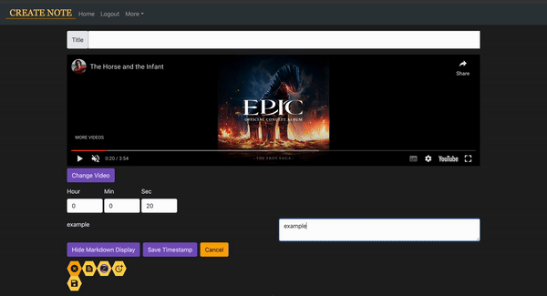

# OnBeat 

## Distinctiveness and Complexity
- This project is a full stack web application fully integrating the Django framework with the React library.
- This Django project have two application that serve as the backend and the frontend of the application, and named as such.
    - The `Backend` application will be responsible for the server side logic and database interactions, with the primary goal of handling requests and delivering responses.
    - The `Frontend` will utilise React to render the client-side interface providing a user interactive application.
- In the previous `Network` and `Mail` project, a single Django application will render the templates of appliction while the interactive user interface is implemented by asynchronous fetch requests or using `Babel` to translate JSX code written directly into the script of the HTML file.
    - This `OnBeat` project distinctiveness and complexity stems mostly on the setting the React app into the application.

### <ins>React</ins>
- Two Django applications were created, `Backend` and `Frontend`.
- In the `Frontend` application, folders for `static` files and `templates` were created. This application will serve to render all client side interactivity for the application.
- The Models for this project will be stored in the `Backend` application, which will be responding to requests made by the client from the `Frontend` application with API responses.
<details>
<summary> Why </summary>
<hr></hr>

- In the previous projects, the application could function without the separation of the application into frontend and backend portions.
- The decision to do such originates mostly from the interest to explore and learn more of React as it offers many benefits such as:
    - Providing interactive user interface
    - Components reusability
    - Rich library

- By integrating React with Django, separating the backend and frontend portions of the application had been proven to keep the project more organised and streamlined.
- Changes to either frontend or backend of the application was more manageable, as the entire procedure was compartmentalised into smaller pieces. This ease the troubleshooting process as it makes it easier to pinpoint any irregularities.
- This also makes the development process more flexible and efficient, as each task is delegated and tackled separately without having to worry that it would break the entire application.
<hr></hr>
</details>

- After setting up a Node project with `npm init` in the `Frontend` application, several packages and modules were installed including but not limited to:
    - [webpack](https://www.npmjs.com/package/webpack)
    - [babel](https://www.npmjs.com/package/Babel)
    - [react](https://www.npmjs.com/package/react)
    - [react-router-dom](https://www.npmjs.com/package/react-router-dom)
    - [react-dom](https://www.npmjs.com/package/react-dom)


The distinctiveness of this project includes the use of other third-party packages such as:
    <details>
    <summary><i>Material UI Icon</i></summary>
    <hr></hr>

-   
    - This project uses [Material UI Icons](https://mui.com/material-ui/material-icons/) to style the application.
 
    
    

    - Material UI also have a powerful and flexible styling system for React components, however bootstrap library was used for this project solely for familiarity sake.
    <hr></hr>
    </details>

    <details>
    <summary><i>react-youtube</i></summary>
    <hr></hr>

    - [react-youtube](https://www.npmjs.com/package/react-youtube) is a simple react component acting as a thin layer over the [Youtube IFrame Player API](https://developers.google.com/youtube/iframe_api_reference).
    - Props passed to this component allow the application to access the player in a similar way to the official api, but takes away the complexity of setting up the player in the first place.
    - The use of this API also separates this `OnBeat` project from the rest. Aside from playing the video, the component and API is used to:
        - Render certain components before or after the video is ready to be played.

        

        - Automatically set the timestamp time input to the current time of the video.

        

        - Handle the input of timestamps to make sure that the given timestamps does not exceed the duration of the video.

        

        - Handle error events for invalid video.

        

        - Skip the video to the specified time according to the timestamp clicked.

        

        - Load the video at the time corresponding with the timestamp when the `/search` route is used.

        

        - Automatically scroll to the appropriate timestamp note that correspond to the current time playing on the video when the `OnBeat` function is on.

        

    <hr></hr>
    </details>


<details>
<summary><i>react-markdown</i></summary>
<hr></hr>

- Notes in this application is formatted from plaintext into markdown using [react-markdown](https://www.npmjs.com/package/react-markdown/v/8.0.6).
- Although inspired from the `wiki` project, it differs in that this application renders the text client-side without having to make a request to the server. This allows the markdown component to be rendered even while the user is writing the note.


<hr></hr>
</details>

### <ins>Asyncronous fetch request</ins>

- As React is used for the frontend, any request to the server is done asynchronously. This also allows the application to handle errors more affectively such as `IntegrityError` when saving data to the database.
    <details>
    <summary>image</summary>

    
    </details>


- Single-Page style is used to display the search results, list of notes, and the bookmarked notes.
    - With changes in the pagination, only the components displayed were changed following the response from the request.
    - This provides a fast and responsive page especially with the `/search` function of the application where the results are rendered with every input the user make in the search bar and changes made to the filter toggles.
    <details>
    <summary>image</summary>

    
    </details>

- It is also used to determine and alter the bookmark status of a note.
    <details>
    <summary>image</summary>

    
    </details>

### <ins>Mobile responsiveness</ins>

- Using a mobile-first approach, this application was developed to be responsive and fluid, taking into consideration on how this application will be displayed in a mobile setting.

    <details>
    <summary>image</summary>

    
    

    </details>

### <ins>OnBeat</ins>

- The heart of this project is ultimately to make a web application that allows user to watch youtube videos while reading or taking notes simultaneously.
- It is estimated the numbers of smartphones in the world is about [90% of the global population](https://explodingtopics.com/blog/smartphone-stats), but the amount of person that owned a PC varies across the globe.

    

    <small><i>image courtesy of [world population review](https://worldpopulationreview.com/country-rankings/computers-per-capita-by-country)</i></small>

- Firstly, the note portion of the application is made scrollable should a youtube video is available to make the video still visible to the user while reading the notes.

    <details>
    <summary>Image</summary>

    
    
    </details>

- This also applies when the user is taking notes. The component for inputing new note or timestamp is scrolled into view on click as it will be hidden initially. 

    <details>
    <summary>Image</summary>

    
    </details>

- Finally, this application will have the `OnBeat` function for notes that are linked with a youtube video.
    - When the `OnBeat` function is active, it is represented by the moving icon on the setting button, animated using CSS.
    - When active, the timestamps of the note will be hidden and when the video is played, the timestamp note will automatically scroll into view when the current time of the video corresponds with the given timestamp.
    - This allows for a seamless experience for the user to view the youtube video while reviewing the notes.

    <details>
    <summary>Image</summary>

    
    </details>


## Project Files

<details>
<summary><ins><b>.github/workflows</b></ins></summary>

#### cy.yml

</details>


<details>
<summary><ins><b>backend</b></ins></summary>
    <hr></hr>

- 
    <details>
    <summary><b>views.py</b></summary>

    view
    </details>

    <details>
    <summary><b>helpers.py</b></summary>

    helpers
    </details>

    #### urls.py
    - urls

    #### models.py
    - models

    #### admin.py
    - configuration for the admin interface

    #### test.py
    - test

    <hr></hr>
</details>


<details>
<summary><ins><b>frontend</b></ins></summary>
    <hr></hr>

- 
    <details>
    <summary><b>src</b></summary>

    - <details>
        <summary>components</summary>
        
        <details>
        <summary><i>App.js</i></summary>

        apps.js
        </details>

    <details>
    <summary><i>AuthContext.js</i></summary>
    </details>

    <details>
    <summary><i>BasicModal.js</i></summary>
    </details>

    <details>
    <summary><i>CreateNote.js</i></summary>
    </details>

    <details>
    <summary><i>CSRFCookie.js</i></summary>
    </details>

    <details>
    <summary><i>DisplayNoteComponent.js</i></summary>
    </details>

    <details>
    <summary><i>DisplayTimestamp.js</i></summary>
    </details>

    <details>
    <summary><i>ExpandMenu.js</i></summary>
    </details>

    <details>
    <summary><i>getVideoID.js</i></summary>
    </details>

    <details>
    <summary><i>Homepage.js</i></summary>
    </details>

    <details>
    <summary><i>ListOfNotes.js</i></summary>
    </details>

    <details>
    <summary><i>LoadingSpinner.js</i></summary>
    </details>

    <details>
    <summary><i>Login.js</i></summary>
    </details>

    <details>
    <summary><i>MarkdownDisplay.js</i></summary>
    </details>

    <details>
    <summary><i>NavBar.js</i></summary>
    </details>

    <details>
    <summary><i>NewNoteInput.js</i></summary>
    </details>

    <details>
    <summary><i>NewTimestamp.js</i></summary>
    </details>

    <details>
    <summary><i>Note.js</i></summary>
    </details>

    <details>
    <summary><i>NoteCard.js</i></summary>
    </details>

    <details>
    <summary><i>NoteInputField.js</i></summary>
    </details>

    <details>
    <summary><i>Paginator.js</i></summary>
    </details>

    <details>
    <summary><i>PrivateRoutes.js</i></summary>
    </details>

    <details>
    <summary><i>Register.js</i></summary>
    </details>

    <details>
    <summary><i>Search.js</i></summary>
    </details>

    <details>
    <summary><i>TextInputField.js</i></summary>
    </details>

    <details>
    <summary><i>YoutubeIframe.js</i></summary>
    </details>

    <details>
    <summary><i>YoutubeLinkInput.js</i></summary>
    </details>

    </details>
    - This folder contains the components used in the application.

    #### index.js

    </details>

    <details>
    <summary><b>static</b></summary>

    <details>
    <summary>/css</summary>

    - `index.css`
        - The css file, compiled with Sass from `index.scss`
    - `index.scss`
        - Using `--watch index.scss : index.css`, this file was automatically compiled when writing the styles for the application.

    </details>

    - `frontend/main.js`
        - The bundle of all of the Javascript from the `src` file.

    <hr></hr>

    #### templates/frontend
    - `index.html`
        - This is the rendered HTML template
    </details>
</details>


## How to run the application.
1. Install virtualenv

```
pip install virtualenv
```

2. Create a virtual environment

```
python -m venv venv
```

3. Activate the virtual environment

```
venv\Scripts\activate
```

4. Install the required python packages 

```
python -m pip install -r requirements.txt
```

5. Create a .env file
    - The .env file should contain two variables. 
    - The `DJANGO_SECRET_KEY` should hold the value for the `SECRET_KEY` found in the `settings.py` file.
    - The variable `DJANGO_APP_URL` should hold the value for the url of the server when running `manage.py runserver`. For example: `http://127.0.0.1:8000`.

6. Navigate into the Django app file
```
cd OnBeat
```
    - this folder should be the one containing the `manage.py` file.

7. Run the server
```
./manage.py runserver
```

## Any other additional information the staff should know about your project.
