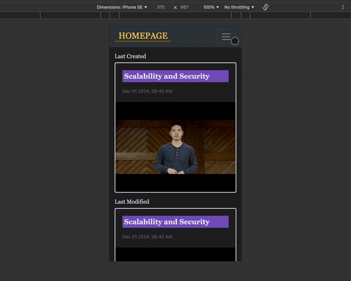

# OnBeat 

## [Video Sample](https://www.youtube.com/watch?v=tGJiHs1g1ig)

## Distinctiveness and Complexity
- This project is a full stack web application fully integrating the Django framework with the React library.
- This Django project have two application that serve as the backend and the frontend of the application, and named as such.
    - The `backend` application will be responsible for the server side logic and database interactions, with the primary goal of handling requests and delivering responses.
    - The `frontend` will utilise React to render the client-side interface providing a user interactive application.
- In the previous `Network` and `Mail` project, a single Django application will render the templates of appliction while the interactive user interface is implemented by asynchronous fetch requests or using `Babel` to translate JSX code written directly into the script of the HTML file.
    - This `OnBeat` project distinctiveness and complexity stems mostly on the setting the React app into the application.

### <ins>React</ins>
- Two Django applications were created, `backend` and `frontend`.
- In the `frontend` application, folders for `static` files and `templates` were created. This application will serve to render all client side interactivity for the application.
- The Models for this project will be stored in the `backend` application, which will be responding to requests made by the client from the `frontend` application with API responses.
<details>
<summary> Why </summary>
<hr></hr>

- In the previous projects, the application could function without the separation of the application into frontend and backend portions.
- The decision to do such originates mostly from the interest to explore and learn more of React as it offers many benefits such as:
    - Providing interactive user interface
    - Components reusability
    - Rich library

- By integrating React with Django, separating the backend and frontend portions of the application had been proven to keep the project more organised and streamlined.
- Changes to either frontend or backend of the application was more manageable, as the entire procedure was compartmentalised into smaller pieces. This ease the troubleshooting process as it makes it easier to pinpoint any irregularities.
- This also makes the development process more flexible and efficient, as each task is delegated and tackled separately without having to worry that it would break the entire application.
<hr></hr>
</details>

- After setting up a Node project with `npm init` in the `Frontend` application, several packages and modules were installed including but not limited to:
    - [webpack](https://www.npmjs.com/package/webpack)
    - [babel](https://www.npmjs.com/package/Babel)
    - [react](https://www.npmjs.com/package/react)
    - [react-router-dom](https://www.npmjs.com/package/react-router-dom)
    - [react-dom](https://www.npmjs.com/package/react-dom)


The distinctiveness of this project includes the use of other third-party packages such as:
    <details>
    <summary><i>Material UI Icon</i></summary>
    <hr></hr>

-   
    - This project uses [Material UI Icons](https://mui.com/material-ui/material-icons/) to style the application.
 
    
    

    - Material UI also have a powerful and flexible styling system for React components, however bootstrap library was used for this project solely for familiarity sake.
    <hr></hr>
    </details>

    <details>
    <summary><i>react-youtube</i></summary>
    <hr></hr>

    - [react-youtube](https://www.npmjs.com/package/react-youtube) is a simple react component acting as a thin layer over the [Youtube IFrame Player API](https://developers.google.com/youtube/iframe_api_reference).
    - Props passed to this component allow the application to access the player in a similar way to the official api, but takes away the complexity of setting up the player in the first place.
    - The use of this API also separates this `OnBeat` project from the rest. Aside from playing the video, the component and API is used to:
        - Render certain components before or after the video is ready to be played.

        

        - Automatically set the timestamp time input to the current time of the video.

        

        - Handle the input of timestamps to make sure that the given timestamps does not exceed the duration of the video.

        

        - Handle error events for invalid video.

        

        - Skip the video to the specified time according to the timestamp clicked.

        

        - Load the video at the time corresponding with the timestamp when the `/search` route is used.

        

        - Automatically scroll to the appropriate timestamp note that correspond to the current time playing on the video when the `OnBeat` function is on.

        

    <hr></hr>
    </details>


<details>
<summary><i>react-markdown</i></summary>
<hr></hr>

- Notes in this application is formatted from plaintext into markdown using [react-markdown](https://www.npmjs.com/package/react-markdown/v/8.0.6).
- Although inspired from the `wiki` project, it differs in that this application renders the text client-side without having to make a request to the server. This allows the markdown component to be rendered even while the user is writing the note.


<hr></hr>
</details>

### <ins>Asyncronous fetch request</ins>

- As React is used for the frontend, any request to the server is done asynchronously. This also allows the application to handle errors more affectively such as `IntegrityError` when saving data to the database.
    <details>
    <summary>image</summary>

    
    </details>


- Single-Page style is used to display the search results, list of notes, and the bookmarked notes.
    - With changes in the pagination, only the components displayed were changed following the response from the request.
    - This provides a fast and responsive page especially with the `/search` function of the application where the results are rendered with every input the user make in the search bar and changes made to the filter toggles.
    <details>
    <summary>image</summary>

    
    </details>

- It is also used to determine and alter the bookmark status of a note.
    <details>
    <summary>image</summary>

    
    </details>

### <ins>Mobile responsiveness</ins>

- Using a mobile-first approach, this application was developed to be responsive and fluid, taking into consideration on how this application will be displayed in a mobile setting.

    <details>
    <summary>image</summary>

    
    

    </details>

### <ins>OnBeat</ins>

- The heart of this project is ultimately to make a web application that allows user to watch youtube videos while reading or taking notes simultaneously.
- It is estimated the numbers of smartphones in the world is about [90% of the global population](https://explodingtopics.com/blog/smartphone-stats), but the amount of person that owned a PC varies across the globe.

    

    <small><i>image courtesy of [world population review](https://worldpopulationreview.com/country-rankings/computers-per-capita-by-country)</i></small>

- Firstly, the note portion of the application is made scrollable should a youtube video is available to make the video still visible to the user while reading the notes.

    <details>
    <summary>Image</summary>

    
    
    </details>

- This also applies when the user is taking notes. The component for inputing new note or timestamp is scrolled into view on click as it will be hidden initially. 

    <details>
    <summary>Image</summary>

    
    </details>

- Finally, this application will have the `OnBeat` function for notes that are linked with a youtube video.
    - When the `OnBeat` function is active, it is represented by the moving icon on the setting button, animated using CSS.
    - When active, the timestamps of the note will be hidden and when the video is played, the timestamp note will automatically scroll into view when the current time of the video corresponds with the given timestamp.
    - This allows for a seamless experience for the user to view the youtube video while reviewing the notes.

    <details>
    <summary>Image</summary>

    
    </details>


## Project Files

<details>
<summary><ins><b>.github/workflows</b></ins></summary>

#### [cy.yml](.github/workflows/cy.yml)
- This file is written to setup GitHub Actions.
    - For every push to the repository, a workflow will run.
    - The workflow will run the testing file after setting up the project dependencies, making sure to catch any errors made by the changes applied.

</details>


<details>
<summary><ins><b>backend</b></ins></summary>
    <hr></hr>

- 
    <details>
    <summary><b>views.py</b></summary>

    [views.py](OnBeat/backend/views.py) will hold the views that will be responding to requests made from the project's client side application, either with database query response or changes to the database.

    Some of the functions in this file will use helper function from [helpers.py](OnBeat/backend/helpers.py).

    Most of the views for this application requires user to be logged in, to prevent one user from having access to another user's note. The user will be redirected to the `/login` route if not authenticated.

    #### login_view
    - Handle POST request for user login, authenticating the user if the username and password match
    - Otherwise, it will return an error response status.
    - This view will only accept a POST request, if the user tried to access this view with any other method, the user will be redirected to the login page of the application.

    #### logout_view
    - Logs out the user, then the user is redirected back to the login page.

    #### register
    - Register a new user
    - User will be redirected to the `/register` route of the application if the user requested this view not with the POST method.
    - Using helper functions, the user's input is validated and error responses will be rendered client-side so the user will know which input was invalid.
    - If all of the field is valid, the user is registered and logged in.

    #### getCurrentUser
    - This view functions to validate user's authentication for user to access the private route of the frontend application.

    #### create_note
    - The body of the post request is validated to create a new note.
    - The title of the note is checked so that each user does not have multiple notes of the same title, case insensitive.
    - Aside from the title of the note, other contents of the notes is optional.
    - Youtube url:
        - The `YoutubeUrl` model have a validation to make sure it is a valid youtube link. If invalid, the note will be removed and the view will respond with an error.
        - Client-side, the application is set not to save timestamps should there be no valid youtube linked to the note. Even so, as a failsafe, any timestamp submitted will be converted into regular note if there is no youtube url given.
    - Other contents of the note is saved with the helper function [`save_noteList_item`](#save_notelist_item). If any exception occurs in saving the note's content, the note will be deleted and the view will respond with an error.

    #### view_note
    - This view takes in an integer argument, which should be the ID of the note the user is trying to view.
    - First of all, it is validated that the note to be viewed exist and is made by the user that is making the request.
    - Then, the view will respond with contents of the notes such as the linked youtube url, notes, or timestamps if any.

    #### delete_note
    - Taking in an argument for the note id, after making sure the note object exist and is created by the requested user, this view will then procede to delete the note.

    #### list_notes
    - This view will return the list of five notes the user created per page, taking in the optional arguments for the requested page number.

    #### search
    - When the user access the `/search` route of the application, a POST request is made with data for the filter applied, the page, and the search query.
    - The search result will be the titles, timestamp text, or plain note text if no filter is applied. 
        - This allows flexibility in the search function and simplifies the display of the search result.
        - The user can view a certain part of the notes without having to load the entire note.
        - Texts from multiple notes across the database could also be viewed in the same page without having to open several notes at once.
    - The resulting list is also sorted with the most recent notes first.


    #### edit_note
    - When the user edit an existing note, the note then the title is validated.
    - The content of the notes are also altered, either with addition, removal, or update.
    - If all the changes are successfully made, the `note.save()` is called to update the date modified of the note as it might not change if the user does not change the note title.

    #### homepage
    - This view return the recently created and modified notes.

    #### bookmarks
    - If a POST request is made to this view, it will return the status of bookmark of the requested note.
    - A PUT request will alter the bookmark status.
    - Otherwise the view will return a two item per page view of notes bookmarked by the user.


    </details>

    <details>
    <summary><b>helpers.py</b></summary>

    [helpers.py](OnBeat/backend/helpers.py) contains some helper functions used by [views.py](OnBeat/backend/views.py), kept separate to make code more organised and easiert to navigate.

    #### Error_message
    - Python class to keep response error message organised. Views responding with this error message will have the client-facing application opening a modal with said message.

    #### validateUsername
    - Validate username for registration of new user, responding with the appropriate error response.

    #### validatePassword
    - Validate password for registration of new user.

    #### validateEmail
    - Validate email for registration of new user.

    #### create_item_and_noteList
    - This function takes a note content; either text or timestamp, a note, and an index, then proceed to save the item to the appropriate database.

    #### save_note_list_item
    - This function is used by [create_note](#create_note) when the user is creating a new note and saving all the list of contents of said note.

    #### edit_item
    - Edit a note content, called by [edit_note](#edit_note) when the user edit an existing note content.

    #### delete_notelist_item
    - Delete the content of the note but not the note or the youtube url itself.

    </details>

    <details>
    <summary><b>urls.py</b></summary>

    - Contains the urls for the `backend` application.
    </details>

    <details>
    <summary><b>models.py</b></summary>

    - Contains the models for the project.
    - A `Note` object will have a relation with the model `User`. This model will then have Foreign key relations with multiple other models.
        - `YoutubeUrl` is set to one-to-one relation with `Note`, allowing each note to only have one url.
            - The url is also validated with `validate_youtube_url`
        - The `Note` model will have a one-to-many relations with the `NoteContent`, `NoteTimestamp`, and  `NoteList` models.
        - The `Notelist` functions to keep track of which index the content of the notes is saved, so that the note is viewed in the correct order while also simplifying the return of the result with the `serialize` method.
            - In this model, the content could only be either the text or timestamp only.
        - In all the above models, it is set for the objects to be deleted should the main `Note` object is deleted.
    - `Bookmarks` will keep track the notes a user bookmarked, restricting that a user could not bookmark anoter user's notes. 
    </details>


    <details>
    <summary><b>admin.py</b></summary>

    - Configuration done for the Django admin interface
    </details>

    <details>
    <summary><b>test.py</b></summary>

    - Runs tests for the application database.
    </details>

<hr></hr>
</details>


<details>
<summary><ins><b>frontend</b></ins></summary>
    <hr></hr>

- 
    <details>
    <summary><b>src</b></summary>

    - <details>
        <summary>components</summary>

        <details>
        <summary><i>App.js</i></summary>

        - Contains the routes for the application.
        </details>

        <details>
        <summary><i>AuthContext.js</i></summary>

        - Provide a way to manage a global state, primarily for the authentication status of the user, but also used to set the title on the navigation bar.
        </details>

        <details>
        <summary><i>BasicModal.js</i></summary>

        - Pops up a modal. The contents and buttons of the modal are passed as props.
        </details>

        <details>
        <summary><i>CreateNote.js</i></summary>

        - Component to create or edit a note.
        </details>

        <details>
        <summary><i>CSRFCookie.js</i></summary>

        - Return the csrftoken to be used for POST request to the server, as per [Django documentation](https://docs.djangoproject.com/en/5.1/howto/csrf/)
        </details>

        <details>
        <summary><i>DisplayNoteComponent.js</i></summary>

        - Display the text only content of a note.
        </details>

        <details>
        <summary><i>DisplayTimestamp.js</i></summary>

        - Display the timestamp of a note and allowing the timestamp link to seek the video to the appropriate time as provided by the timestamp.
        </details>

        <details>
        <summary><i>ExpandMenu.js</i></summary>

        - Menu bar set at the bottom of the note during editing and viewing.
        </details>

        <details>
        <summary><i>getVideoID.js</i></summary>

        - Return the ID of a video from the youtube url.
        </details>

        <details>
        <summary><i>Homepage.js</i></summary>

        - The homepage of the application, displaying the recently created and modified note as well as the bookmarks.
        </details>

        <details>
        <summary><i>ListOfNotes.js</i></summary>

        - Return a list of five notes per page for all the notes the user had created.
        </details>

        <details>
        <summary><i>LoadingSpinner.js</i></summary>

        - Animated component rendered before the video is loading, as the iframe for the youtube video will return blank before it is ready.
        </details>

        <details>
        <summary><i>Login.js</i></summary>

        - Component rendered for the `/login` route for user to log in.
        </details>

        <details>
        <summary><i>MarkdownDisplay.js</i></summary>

        - Display text props as markdown with `react-markdown`
        </details>

        <details>
        <summary><i>NavBar.js</i></summary>

        - Navigation bar component.
        </details>

        <details>
        <summary><i>NewNoteInput.js</i></summary>

        - Input component for when user is inserting new text content to a note.
        </details>

        <details>
        <summary><i>NewTimestamp.js</i></summary>

        - Input component for when user is inserting new timestamp to a note.
        - Timestamp automatically set to current video time when first rendered.
        </details>

        <details>
        <summary><i>Note.js</i></summary>

        - Display a note and its content.
        </details>

        <details>
        <summary><i>NoteCard.js</i></summary>

        - Card to display note that allows the user to view the note when the card is clicked.
        - If the note have a youtube url linked, the ID of the video will be used to display the thumbnail image of said video.
        </details>

        <details>
        <summary><i>NoteInputField.js</i></summary>

        - Rendered with `NewNoteInput.js` component to display the markdown formatting of the user's current input.
        - The markdown display can be toggled off.
        </details>

        <details>
        <summary><i>Paginator.js</i></summary>

        - Component to display pagination.
        - Allow user to input the page number.
        - Disable the previous and next button if there is no such page.
        </details>

        <details>
        <summary><i>PrivateRoutes.js</i></summary>

        - Checks the authentication status of the user and updates the global `Authcontext` state of the user's authentication status.
        - Protects certain routes from unauthenticated user.
        </details>

        <details>
        <summary><i>Register.js</i></summary>

        - Rendered for the `/register` route to register new user
        </details>

        <details>
        <summary><i>Search.js</i></summary>

        - Display a five item per page of search result from all content of the user's notes.
        - The result will be rendered asynchronously with every change to the search query and filter toggles.
        - Timestamps will display along with the video ready to play at the given timestamp value.
        </details>

        <details>
        <summary><i>TextInputField.js</i></summary>

        - Input field that can have props to be passed to display error.
        </details>

        <details>
        <summary><i>YoutubeIframe.js</i></summary>

        - Display the youtube video using `react-youtube` component.
        </details>

        <details>
        <summary><i>YoutubeLinkInput.js</i></summary>

        - Validate the given url as a valid youtube url, then render the youtube iframe.
        </details>

    - This folder contains the components used in the application.

        #### index.js
        - Create a root and render the React components inside of it.
    </details>

    <details>
    <summary><b>static</b></summary>

    
    - <details>
        <summary>css</summary>

        #### index.css
        - This file is linked to the HTML page to apply styling to the application.

        #### index.scss
        - Styling of the application is written in Sass in this file, then compiled into the [index.css](#indexcss) file.
        </details>

        #### frontend/main.js
        - `webpack` will bundle all the javascript file into this file, which will be the script used by the [index.html](#templatesindexhtml) 

    </details>

    #### templates/index.html
    - The html page rendered when the user access the frontend application as all routes in the `frontend` will render this file.
    - Contains link for:
        - [index.css](#indexcss)
        - [main.js](#frontendmainjs)
        - [bootstrap](https://getbootstrap.com/docs/3.3/)
        - [jquery](https://jquery.com/)

<hr></hr>
    </details>


## How to run the application.
1. Install virtualenv

```
pip install virtualenv
```

2. Create a virtual environment

```
python -m venv venv
```

3. Activate the virtual environment

```
venv\Scripts\activate
```

4. Install the required python packages 

```
python -m pip install -r requirements.txt
```

5. Create a .env file
    - The .env file should contain two variables. 
    - The `DJANGO_SECRET_KEY` should hold the value for the `SECRET_KEY` found in the `settings.py` file.
    - The variable `DJANGO_APP_URL` should hold the value for the url of the server when running `manage.py runserver`. For example: `http://127.0.0.1:8000`.

6. Navigate into the Django app file
```
cd OnBeat
```
- this folder should be the one containing the `manage.py` file.

7. Run the server
```
./manage.py runserver
```

